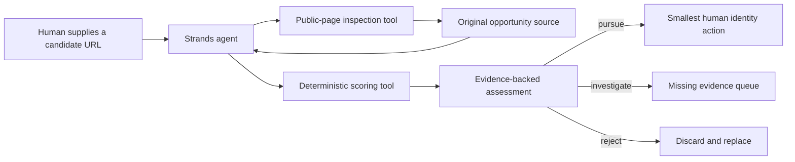

# Architecture

The language model gathers and organizes evidence. It cannot override the
deterministic gates: missing original sources, expired deadlines, entry fees, and
AI prohibitions always reject a candidate in zero-cost mode.

## Trust boundaries

- Public pages are untrusted input.
- Only HTTPS URLs resolving to public IP addresses are fetched.
- Redirect destinations are checked before they are followed.
- Responses are size-limited and never executed.
- The tool does not submit forms, authenticate, or perform security testing.
- Model credentials remain outside the repository.

