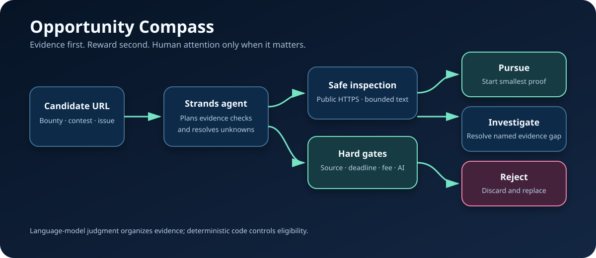

# Opportunity Compass

Opportunity Compass is a conservative AI agent that verifies online earning
opportunities before a person spends time on them. It follows links back to the
original source, checks evidence, and produces an auditable pursue/investigate/reject
decision.

The project was created for the **Agents for Humans Hackathon**. It uses the
[Strands Agents SDK](https://strandsagents.com/) and is designed around a real failure
mode: aggregators can display large rewards even when the original task is deleted,
closed, fee-based, saturated, or incompatible with AI-assisted work.

## What makes it agentic

The Strands agent can:

1. inspect public opportunity and original-source URLs;
2. distinguish evidence from claims made by an aggregator;
3. call a deterministic scoring tool that cannot be persuaded by a large reward;
4. reject stale or incompatible work;
5. identify the smallest unavoidable human action for valid opportunities.

The scoring layer also runs without model credentials, making every verdict testable.



See [ARCHITECTURE.md](ARCHITECTURE.md) for the agent loop and trust boundaries. A
ready-to-paste [Devpost submission](SUBMISSION.md) and [demo script](DEMO_SCRIPT.md)
are included in the repository.

## Quick start

Python 3.11–3.14 is supported by this project.

```powershell
python -m venv .venv
.venv\Scripts\python -m pip install -e ".[dev]"
.venv\Scripts\python -m pytest
.venv\Scripts\opportunity-compass --score examples\first_search.json
```

For a live Strands run, configure a supported model provider. Amazon Bedrock is the
default provider:

```powershell
$env:OPPORTUNITY_COMPASS_MODEL = "global.anthropic.claude-sonnet-4-6"
.venv\Scripts\opportunity-compass "Verify this opportunity: https://example.com"
```

The project also supports a zero-cost local Ollama model:

```powershell
.venv\Scripts\python -m pip install -e ".[dev,local]"
$env:OPPORTUNITY_COMPASS_PROVIDER = "ollama"
$env:OPPORTUNITY_COMPASS_MODEL = "qwen3:4b"
.venv\Scripts\opportunity-compass "Verify this opportunity: https://example.com"
```

Do not commit credentials. See `.env.example` and the
[Strands model-provider documentation](https://strandsagents.com/docs/user-guide/quickstart/python/).

## Rebuild the demo video

The submission video is generated entirely from project facts and the verified live
run. Install the `demo` extra and FFmpeg, then run:

```powershell
.venv\Scripts\python -m pip install -e ".[demo]"
.venv\Scripts\python scripts\render_demo.py
```

The MP4 is written to `artifacts/opportunity-compass-demo.mp4`.

## Safety boundary

Opportunity Compass reads public pages and evaluates published terms. It does not
perform vulnerability testing, submit forms, create accounts, impersonate people, or
make financial transactions.

## AI disclosure

OpenAI Codex materially assisted with product design, implementation, documentation,
and testing. The human entrant remains responsible for reviewing the code and the
official competition rules before submission.
